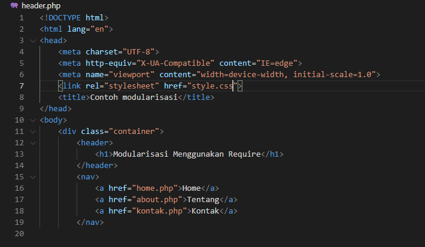
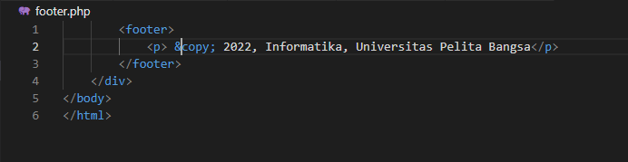
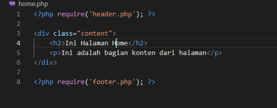
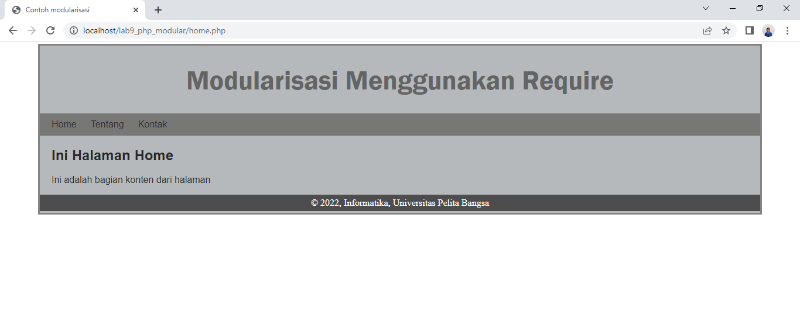
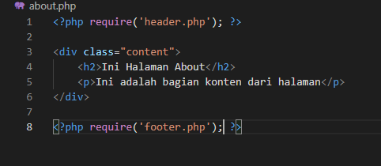
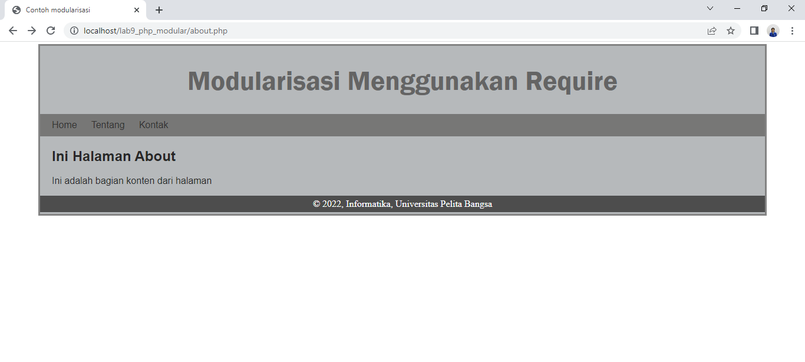

Nama : Rahmat

NIM : 312010229

Kelas : TI.20.A.2

# Lab9Web

## PHP Modular

Buat file baru dengan nama **header.php**

Ini kodenya

Dan buat file baru dengan nama **footer.php**

Ini kodenya

Buat file baru dengan nama **home.php**

Ini kodenya

Ini tampilannya di browser

Buat file baru dengan nama **about.php**

Ini kodenya

Ini tampilannya di browser

